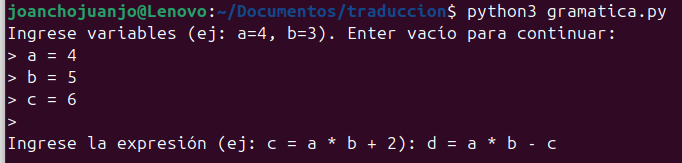
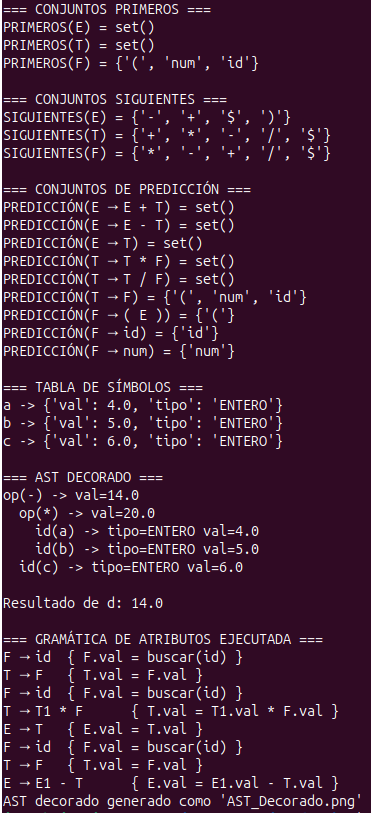
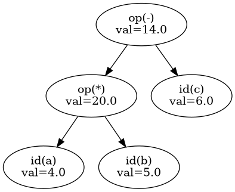

# Traduccion_Dirigida_Por_Sintaxis

### 1. Diseño de la gramática

Se definió una gramática libre de contexto que representa expresiones aritméticas simples con suma, resta, multiplicación, división, paréntesis, identificadores (id) y números (num).

La estructura jerárquica garantiza la precedencia de operadores (* y / antes que + y -), y permite evaluar expresiones anidadas con paréntesis.

```python
gramatica = (
    ("E", ["E", "+", "T"]),
    ("E", ["E", "-", "T"]),
    ("E", ["T"]),
    ("T", ["T", "*", "F"]),
    ("T", ["T", "/", "F"]),
    ("T", ["F"]),
    ("F", ["(", "E", ")"]),
    ("F", ["id"]),
    ("F", ["num"])
)
```
### 2. Definir atributos

Se definieron atributos sintéticos para los no terminales, indicando el tipo de valor que manejan.
Los terminales (id y num) se asocian a tipos de datos específicos (string, float) y los no terminales (E, T, F) calculan el atributo val (valor numérico final).

```python
atributos = {
    "E": {"val": "float"},
    "T": {"val": "float"},
    "F": {"val": "float"},
    "id": {"tipo": "string"},
    "num": {"tipo": "float"}
}
```
### 3. Calcular Primeros, Siguientes y Predicción

A partir de la gramática, se implementaron funciones que calculan los conjuntos PRIMEROS, SIGUIENTES y PREDICCIÓN para cada producción.
Estos conjuntos son fundamentales para construir un analizador predictivo LL(1) y verificar la corrección de la gramática.

```python
# ------------------ PRIMEROS ------------------
def primeros(gramatica):
    primeros = {}
    for nt, _ in gramatica:
        primeros[nt] = set()

    cambio = True
    while cambio:
        cambio = False
        for nt, prod in gramatica:
            simbolo = prod[0]
            if simbolo not in [x for x, _ in gramatica]:
                primeros[nt].add(simbolo)
            else:
                primeros[nt] |= primeros.get(simbolo, set())
    return primeros

# ------------------ SIGUIENTES ------------------
def siguientes(gramatica, first):
    siguientes = {nt: set() for nt, _ in gramatica}
    siguientes["E"].add("$")

    cambio = True
    while cambio:
        cambio = False
        for nt, prod in gramatica:
            for i, simbolo in enumerate(prod):
                if simbolo in [x for x, _ in gramatica]:
                    siguiente = prod[i + 1:] if i + 1 < len(prod) else None
                    if siguiente:
                        prox = siguiente[0]
                        if prox in [x for x, _ in gramatica]:
                            siguientes[simbolo] |= first[prox]
                        else:
                            siguientes[simbolo].add(prox)
                    else:
                        siguientes[simbolo] |= siguientes[nt]
    return siguientes

# ------------------ PREDICCIÓN ------------------
def prediccion(gramatica, first, follow):
    predict = {}
    for nt, prod in gramatica:
        simbolo = prod[0]
        conjunto = set()
        if simbolo not in [x for x, _ in gramatica]:
            conjunto.add(simbolo)
        else:
            conjunto |= first[simbolo]
        if "ε" in conjunto:
            conjunto.remove("ε")
            conjunto |= follow[nt]
        predict[(nt, " ".join(prod))] = conjunto
    return predict
```

### 4. General el AST Decorado

El AST se genera de forma recursiva según las reglas gramaticales.
Cada nodo representa un operador (op(+), op(*), etc.), un identificador (id(a)) o un número (num(3)), y contiene información sobre su tipo de dato.

```python
def analizar_expresion(expresion):
    tokens = expresion.replace('(', ' ( ').replace(')', ' ) ').split()
    pos = 0

    def E():
        nonlocal pos
        nodo = T()
        while pos < len(tokens) and tokens[pos] in ['+', '-']:
            op = tokens[pos]
            pos += 1
            der = T()
            nodo = Nodo(f"op({op})", izq=nodo, der=der)
        return nodo

    def T():
        nonlocal pos
        nodo = F()
        while pos < len(tokens) and tokens[pos] in ['*', '/']:
            op = tokens[pos]
            pos += 1
            der = F()
            nodo = Nodo(f"op({op})", izq=nodo, der=der)
        return nodo

    def F():
        nonlocal pos
        tok = tokens[pos]
        if tok == '(':
            pos += 1
            nodo = E()
            pos += 1
            return nodo
        elif tok.isalpha():
            pos += 1
            info = tabla_simbolos.get(tok, {"val": 0, "tipo": "ENTERO"})
            return Nodo(f"id({tok})", tipo=info["tipo"])
        else:
            pos += 1
            return Nodo(f"num({tok})", tipo="REAL")

    return E()
```

### 5. Generar la tabla de símbolos

La tabla de símbolos se genera dinámicamente según las variables que el usuario ingresa al inicio.
Cada variable contiene su valor numérico y tipo asociado.

```python
def leer_variables():
    print("Ingrese variables (ej: a=4, b=3). Enter vacío para continuar:")
    while True:
        linea = input("> ").strip()
        if not linea:
            break
        if "=" in linea:
            nombre, valor = linea.split("=")
            nombre, valor = nombre.strip(), valor.strip()
            try:
                valor = float(valor)
            except ValueError:
                print("Valor no numérico, se ignora.")
                continue
            tabla_simbolos[nombre] = {"val": valor, "tipo": "ENTERO"}
        else:
            print("Formato inválido. Use a=3")
```

### 6. Generar la gramática de atributos

La gramática de atributos describe cómo se calculan los valores (atributos) a medida que se recorre el árbol.
A continuación, se muestra su versión traducida a la forma clásica EDTS:

```python
def analizar_expresion(expresion):
    tokens = expresion.replace('(', ' ( ').replace(')', ' ) ').split()
    pos = 0

    def E():
        nonlocal pos
        nodo = T()
        E_val = nodo.val
        traza_semantica.append("E → T\t{ E.val = T.val }")

        while pos < len(tokens) and tokens[pos] in ['+', '-']:
            op = tokens[pos]
            pos += 1
            der = T()
            if op == '+':
                E_val = nodo.val + der.val
                traza_semantica.append("E → E1 + T\t{ E.val = E1.val + T.val }")
            elif op == '-':
                E_val = nodo.val - der.val
                traza_semantica.append("E → E1 - T\t{ E.val = E1.val - T.val }")
            nodo = Nodo(f"op({op})", izq=nodo, der=der, val=E_val)
        nodo.val = E_val
        return nodo

    def T():
        nonlocal pos
        nodo = F()
        T_val = nodo.val
        traza_semantica.append("T → F\t{ T.val = F.val }")

        while pos < len(tokens) and tokens[pos] in ['*', '/']:
            op = tokens[pos]
            pos += 1
            der = F()
            if op == '*':
                T_val = nodo.val * der.val
                traza_semantica.append("T → T1 * F\t{ T.val = T1.val * F.val }")
            elif op == '/':
                T_val = nodo.val / der.val
                traza_semantica.append("T → T1 / F\t{ T.val = T1.val / F.val }")
            nodo = Nodo(f"op({op})", izq=nodo, der=der, val=T_val)
        nodo.val = T_val
        return nodo

    def F():
        nonlocal pos
        tok = tokens[pos]

        if tok == '(':
            pos += 1
            nodo = E()
            pos += 1
            nodoF = Nodo("()", izq=nodo, val=nodo.val)
            traza_semantica.append("F → (E)\t{ F.val = E.val }")
            return nodoF

        elif tok.isalpha():
            pos += 1
            if tok not in tabla_simbolos:
                raise ValueError(f"Variable '{tok}' no definida.")
            val = tabla_simbolos[tok]["val"]
            tipo = tabla_simbolos[tok]["tipo"]
            nodo = Nodo(f"id({tok})", tipo=tipo, val=val)
            traza_semantica.append("F → id\t{ F.val = buscar(id) }")
            return nodo

        else:
            pos += 1
            val = float(tok)
            nodo = Nodo(f"num({tok})", tipo="REAL", val=val)
            traza_semantica.append("F → num\t{ F.val = num.lexval }")
            return nodo

    return E()
```

### 7. Generar la EDTS

#### Entrada:



#### Salida: 



#### Arbol Generado: 


